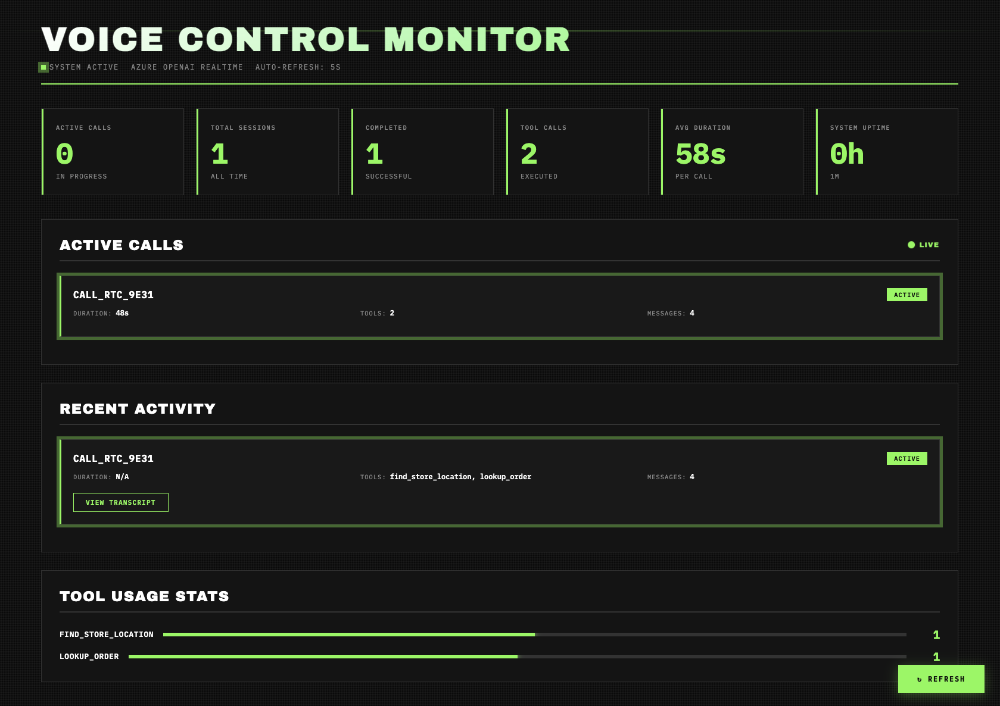
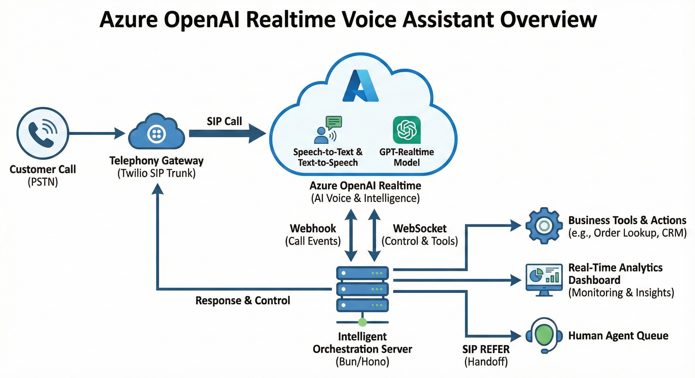

# Azure OpenAI Realtime Voice Assistant

> **Experimental phone voice assistant** powered by Azure OpenAI Realtime (SIP). Handles inbound calls, orchestrates tool calls, and provides comprehensive monitoring. Built to test latency and explore the Realtime API capabilities.

[](https://www.typescriptlang.org/)
[](https://bun.sh)
[](LICENSE)

> ⚠️ **Experimental Project**: This is a research/experimental project built to explore Azure OpenAI Realtime capabilities and test latency. Not intended for production use without significant additional work on security, scalability, and reliability.

---

## 🎯 What This Does

A **Bun/Hono service** that receives `realtime.call.incoming` webhooks from **Azure OpenAI Realtime (SIP)**, configures voice sessions, handles tool calls, and can forward callers to human agents via SIP **REFER**. This project focuses on the **control plane** (call acceptance, WebSocket orchestration, tools, logging)—media (RTP) is handled entirely by Azure/Twilio.

**Built to explore:**
- 🎤 **Voice-enabled interactions** with Azure OpenAI Realtime
- 📞 **Phone-based AI assistants** with tool integration
- 🔄 **Hybrid AI/human** call routing via SIP REFER
- 📊 **Real-time call monitoring** and analytics
- 🚀 **Low-latency voice interactions** (tested when deployed in the same Azure region)

---

## 📊 Real-Time Dashboard

**Monitor your voice assistant in real-time** with a beautiful, auto-refreshing dashboard:



**Access:** `http://localhost:8000/dashboard`

The dashboard provides:
- 📈 **Live statistics** — Active calls, total sessions, tool usage, average duration
- 🔴 **Active calls** — Real-time view of ongoing conversations with caller phone numbers, duration, tools used, and message counts
- 📜 **Recent activity** — Complete call history with caller information, sentiment analysis and transcripts
- 📊 **Tool analytics** — Visual charts showing which tools are most frequently used
- ⚡ **Live updates** — Server-Sent Events (SSE) for real-time, non-intrusive updates without page refreshes

Perfect for demos, monitoring, and understanding your voice assistant's performance at a glance.

### Latency instrumentation
- The dashboard now shows **Avg Latency (ms)**, derived from user transcript completion to first assistant response per turn.
- Raw values are streamed via `/api/events` and exposed in `/api/stats` under `averageLatencyMs`.
- Console logs include `latency_measured_ms` lifecycle entries for deeper analysis.
- Expect lower latency when the webhook server and Azure Realtime resource run **in the same Azure region** (avoid hairpin across clouds).
- Observed in local tests (server on laptop, Azure SIP in-cloud) ~1.3s user-stop → assistant audio start; co-locating the server in Azure should reduce this significantly.

---

## ✨ Key Features

### 🎙️ Voice Assistant Capabilities
- **Natural conversations** powered by Azure OpenAI Realtime
- **9 built-in tools** ready to use (order lookup, inventory, weather, store locator, and more)
- **Barge-in support** — Users can interrupt naturally
- **SIP REFER** — Seamless handoff to human agents
- **Multi-language ready** — Easy prompt customization

### 📊 Monitoring & Analytics
- **Real-time dashboard** with beautiful UI
- **Comprehensive analytics** — Call duration, tool usage, sentiment analysis
- **Latency tracing** — Per-turn latency (user speech → assistant reply) captured and averaged; visible on the dashboard and via `/api/stats`
- **Admin API** — RESTful endpoints for integrations
- **Enhanced logging** — Color-coded console output with call summaries
- **Transcript viewer** — Full conversation history per call

### 🛠️ Developer Experience
- **TypeScript** with full type safety
- **Zod validation** for all tool arguments
- **Hot reload** development mode
- **PII redaction** in logs
- **Extensible architecture** — Easy to add new tools

---

## 🏗️ Architecture



**Quick Reference:**
```
PSTN ↔ Twilio Elastic SIP Trunk → Azure OpenAI Realtime (SIP)
                                 ↘ (Webhook: realtime.call.incoming)
                                   Your Bun/Hono Server
                                      ├─ POST /accept      (REST)
                                      ├─ wss /v1/realtime?call_id=... (control)
                                      ├─ tools (function calls)
                                      ├─ /dashboard        (monitoring)
                                      ├─ /api/*            (admin API)
                                      └─ POST /refer       (REST, on handoff)
```

**Call Flow:**
1. Inbound call hits the **Azure Realtime SIP connector** configured for your Azure OpenAI resource
2. Azure posts **`realtime.call.incoming`** webhook to your server
3. Your server **accepts** the call (REST), then attaches to the call control **WebSocket**
4. The bot greets, listens, calls tools, and can **REFER** to a human queue
5. All activity is tracked in real-time on the dashboard

---

## 🚀 Quick Start

### Prerequisites

- **Azure subscription** with an **Azure OpenAI** resource in a supported region (e.g., Sweden Central)
- A **model deployment** named `gpt-realtime` (Azure AI Foundry → Deployments)
- **API key** for your Azure OpenAI resource
- **Public URL** for webhook (local: use `ngrok` or Cloudflare Tunnel)
- (Optional) **Twilio** account for Elastic SIP Trunking

### Installation

```bash
# Clone the repository
git clone <your-repo>
cd <your-repo>

# Install dependencies
bun install

# Copy environment template
cp env.template .env
```

### Configuration

Edit `.env` with your Azure OpenAI credentials:

```env
# Azure OpenAI Configuration
OPENAI_API_KEY=YOUR_AZURE_OPENAI_KEY
OPENAI_WEBHOOK_SECRET=                    # Set after creating webhook endpoint
REALTIME_MODEL=gpt-realtime
REALTIME_VOICE=marin                     # Any supported voice (marin, alloy, etc.)
SIP_TARGET_URI=                          # Optional: tel:+1AAA BBB CCCC (for REFER)
PORT=8000

# Azure Endpoints (replace with your resource subdomain)
OPENAI_BASE=https://<your-resource>.openai.azure.com/openai
REALTIME_WS_BASE=wss://<your-resource>.openai.azure.com/openai/v1/realtime

# Leave empty for Azure Realtime (don't add api-version)
REALTIME_API_VERSION=

# Logging (optional)
LOG_FORMAT=pretty                        # 'pretty' for color-coded logs, 'json' for structured
DEBUG_LOGGING=0                          # Set to '1' to enable verbose event logging
```

> **Important:** Do **not** append `api-version` to Realtime WS/REST URLs. The Azure Realtime SIP control plane accepts `/v1/...` without it.

### Start the Server

```bash
# Development mode (hot reload)
bun run dev

# Production mode
bun run start
```

The server will print:
```
Server listening on http://localhost:8000/
Dashboard available at: /dashboard
```

**Health checks:**
- `GET /healthz` → `{ ok: true }`
- `GET /` → Service info

### Expose Your Webhook (Local Development)

```bash
# Using ngrok
npx ngrok http 8000

# Note the https://<subdomain>.ngrok-free.app URL
# You'll use this in the next step
```

---

## 🔌 Azure OpenAI Realtime (SIP) Setup

### Step 1: Create Webhook Endpoint

Create a webhook endpoint in Azure that points to your public server URL:

```bash
curl -sS -X POST "https://<your-resource>.openai.azure.com/openai/v1/dashboard/webhook_endpoints" \
  -H "Content-Type: application/json" \
  -H "api-key: <YOUR_AZURE_OPENAI_KEY>" \
  -d '{
    "name": "realtime-incoming",
    "url": "https://<your-public-host>/openai/webhook",
    "event_types": ["realtime.call.incoming"]
  }'
```

After creating, Azure will show a **Webhook Signing Secret**. Add it to your `.env`:

```env
OPENAI_WEBHOOK_SECRET=your_secret_here
```

### Step 2: Deploy the Model

In **Azure AI Foundry → Deployments**, deploy `gpt-realtime` (Global Standard). Ensure your `.env` uses `REALTIME_MODEL=gpt-realtime` (deployment name, not model family).

---

## 📞 Twilio Elastic SIP Trunking

Twilio routes PSTN calls to Azure's SIP connector. Point your SIP trunk at the SIP URI Azure provides for your resource/project.

**Step-by-step guide:**
- [Twilio: OpenAI Realtime API + Elastic SIP Trunking](https://www.twilio.com/en-us/blog/developers/tutorials/product/openai-realtime-api-elastic-sip-trunking)

**Quick steps:**
1. In Twilio, create an **Elastic SIP Trunk**
2. Add an **Origination URI** pointing to your **Azure OpenAI SIP connector URI** (looks like `sip:proj_...@sip.api.openai.azure.com`)
3. Assign a **Twilio phone number** to the trunk
4. Call that number → Twilio routes to Azure → Azure triggers your webhook

---

## 🌐 Using OpenAI's Native Realtime API (No Azure)

Prefer the stock OpenAI cloud? The same service works there too—just swap the endpoints in `.env`.

**1. Configure OpenAI webhooks + SIP:**
- Navigate to [OpenAI Platform Settings](https://platform.openai.com/settings/)
- Create webhook: `https://<your-public-host>/openai/webhook`
- Create SIP connection: `sip:<project-id>@sip.api.openai.com;transport=tls`
- Copy webhook secret to `.env`

**2. Update `.env`:**
```env
OPENAI_BASE=https://api.openai.com
REALTIME_WS_BASE=wss://api.openai.com/v1/realtime
REALTIME_API_VERSION=
```

**3. Restart and test:**
```bash
bun run dev
# Call your number → OpenAI posts webhook → same flow!
```

---

## 🎉 Demo Features

This project includes extensive demo and monitoring capabilities perfect for showcasing your voice assistant.

### 📊 Real-Time Dashboard

Visit `http://localhost:8000/dashboard` to see:

- **Live Statistics**
  - Active calls counter with pulse animation
  - Total calls handled (all-time)
  - Completed calls
  - Total tool executions
  - Average call duration
  - System uptime

- **Active Calls Section**
  - Real-time view of ongoing conversations
  - Caller phone number (extracted from SIP headers)
  - Call duration counter
  - Tools used per call
  - Message count
  - Status indicators

- **Recent Activity**
  - Last 5 calls with complete details
  - Call status (active, completed, failed, transferred)
  - Duration, tool usage, transcripts
  - Color-coded by status
  - "View Transcript" button for each call

- **Tool Usage Analytics**
  - Visual bar charts showing tool popularity
  - Percentage breakdown of tool calls
  - Real-time updates

**Demo Tip:** Keep the dashboard open on a second screen during demos to wow your audience!

### 🔧 Built-in Tools (9 Total)

1. **`handoff_human`** — Transfer to live agent (SIP REFER)
2. **`lookup_order`** — Check order status by order number
3. **`check_inventory`** — Product availability lookup
4. **`schedule_callback`** — Book a callback appointment
5. **`get_weather`** — Get weather for any location
6. **`check_company_hours`** — Business hours lookup
7. **`search_products`** — Product catalog search
8. **`find_store_location`** — Nearest store finder

All tools include:
- **Zod validation** for type-safe arguments
- **Error handling** with graceful fallbacks
- **Follow-up instructions** for natural conversation flow

### 🎨 Enhanced Console Logging

Beautiful color-coded logs (enable with `LOG_FORMAT=pretty`):

- 📞 **CALL** (Cyan) — Call lifecycle events
- 🔧 **TOOL** (Magenta) — Tool executions with status
- 💬 **TRANSCRIPT** (White) — User/assistant conversations
- ✓ **SUCCESS** (Green) — Successful operations
- ⚠ **WARNING** (Yellow) — Important notices
- ✗ **ERROR** (Red) — Problems and failures
- ℹ **INFO** (Blue) — General information

**Special features:**
- Timestamps with millisecond precision
- Call ID tags for easy tracking
- Beautiful boxed call summaries
- Periodic system statistics display
- Startup banner

### 📈 Analytics & Metrics Engine

Comprehensive tracking of every aspect:

**Call Metrics:**
- Caller identification (phone number from SIP headers)
- Start/end times and duration
- Tool calls with execution timing
- Full conversation transcripts
- User sentiment analysis (positive/neutral/negative)
- Barge-in events (user interruptions)
- Response counts

**System Statistics:**
- Total/active/completed calls
- Failed and transferred calls
- Average call duration
- Tool usage patterns
- System uptime

### 🔌 Admin API Endpoints

RESTful API for integrations and monitoring:

| Endpoint | Description |
|----------|-------------|
| `GET /api/stats` | System-wide statistics |
| `GET /api/calls` | Recent calls (use `?limit=N` to customize) |
| `GET /api/calls/active` | Currently active calls |
| `GET /api/calls/:callId` | Detailed metrics for a specific call |
| `GET /api/calls/:callId/transcript` | Full conversation transcript |

**Example:**
```bash
# Get system stats
curl http://localhost:8000/api/stats | jq

# Get recent calls
curl http://localhost:8000/api/calls?limit=20 | jq

# Get specific call details
curl http://localhost:8000/api/calls/CALL_RTC_9E31 | jq
```

**See [DEMO_FEATURES.md](./DEMO_FEATURES.md) for complete documentation and demo script suggestions.**

---

## 📋 Configuration Reference

| Variable | Required | Description |
|----------|----------|-------------|
| `OPENAI_API_KEY` | ✅ | Azure OpenAI **resource** API key |
| `OPENAI_WEBHOOK_SECRET` | ✅ | Webhook signing secret from Azure/OpenAI |
| `REALTIME_MODEL` | ✅ | Azure deployment name (e.g., `gpt-realtime`) |
| `REALTIME_VOICE` | ✅ | Voice name (e.g., `marin`, `alloy`) |
| `SIP_TARGET_URI` | ➖ | Destination for REFER (e.g., `tel:+1XXXXXXXXXX`) |
| `PORT` | ➖ | Server port (defaults to `8000`) |
| `OPENAI_BASE` | ✅ (Azure) | `https://<resource>.openai.azure.com/openai` |
| `REALTIME_WS_BASE` | ✅ (Azure) | `wss://<resource>.openai.azure.com/openai/v1/realtime` |
| `REALTIME_API_VERSION` | ✖ | Leave empty for Azure Realtime |
| `TEST_MODE` | ➖ | `1` disables signature verification (local tests only) |
| `LOG_FORMAT` | ➖ | `pretty` (default) or `json` for structured logs |

---

## 🛠️ Commands

```bash
# Development (hot reload)
bun run dev

# Production
bun run start

# Run tests
bun test

# Smoke test webhook (offline, no Azure/Twilio)
TEST_MODE=1 bun run scripts/smoke-sip-webhook.ts
```

> **Note:** `smoke-realtime-ws.ts` targets `api.openai.com` and validates account-level realtime, not Azure SIP. For full Azure SIP verification, place a real call or use the webhook smoke with `TEST_MODE=1`.

---

## 🔍 How It Works (Deep Dive)

1. **Webhook Verification**: `POST /openai/webhook` validates the request signature (or bypasses with `TEST_MODE=1`)

2. **Call Acceptance**: On `realtime.call.incoming`, the server POSTs `/v1/realtime/calls/{call_id}/accept` with your model, tools, and instructions

3. **WebSocket Connection**: Connects to `wss://.../v1/realtime?call_id=...` using `api-key` header (Azure) and sends `session.update` to configure voice/instructions

4. **Turn-Taking**: Listens for speech start/stop and transcription events to request concise turn responses

5. **Tool Execution**: Function-call items stream in; arguments are collected, validated with `zod`, and executed (handoff_human, lookup_order, check_inventory, etc.)

6. **Human Handoff**: `handoff_human` tool triggers a `/refer` to `SIP_TARGET_URI`

7. **Observability**: Structured logs with PII redaction, real-time dashboard updates, and comprehensive analytics

---

## 🔧 Extending the Bot

### Adding a New Tool

Implement a `ToolDefinition` in `src/tools.ts`:

```typescript
{
  name: 'my_new_tool',
  description: 'What this tool does',
  schema: z.object({
    param: z.string().describe('Parameter description'),
  }),
  jsonSchema: { /* OpenAI function schema */ },
  handler: async (args, ctx) => {
    // Your logic here
    return {
      output: { result: 'success' },
      followUpInstructions: 'Tell the user about the result',
    };
  },
}
```

The tool automatically appears in `realtimeToolSchemas` and is available to the assistant.

### Customizing Prompts

Edit `src/prompts.ts` (`systemPrompt`, `greetingPrompt`). Keep prompts concise—Realtime responds quickly to short, intentional instructions.

### Connecting Real Data

For real-world use, your tool handlers would query internal APIs/databases and return summarized payloads for the bot to explain naturally. Currently, the included tools use demo/mock data.

---

## ☁️ Deploying to Azure (Low Latency)

Running your control plane **in the same Azure region** as your Azure OpenAI resource minimizes WebSocket round-trips and avoids public-internet hairpins.

**Deployment Options:**
- **Azure Container Apps** or **Azure App Service** — Containerize or run Bun directly
- **Azure VM / Scale Set** — Maximum control and custom networking
- **Azure Functions** — Not ideal (HTTP + WS requires long-lived connections; prefer process-based hosts)

**After Deployment:**

1. Update webhook endpoint with your Azure-hosted HTTPS domain:
   ```bash
   curl -sS -X POST "https://<your-resource>.openai.azure.com/openai/v1/dashboard/webhook_endpoints" \
     -H "Content-Type: application/json" \
     -H "api-key: <YOUR_AZURE_OPENAI_KEY>" \
     -d '{
       "name": "realtime-incoming",
       "url": "https://<your-azure-host>/openai/webhook",
       "event_types": ["realtime.call.incoming"]
     }'
   ```

2. Twilio stays the same (still points at Azure's SIP connector)

3. Keep the same `OPENAI_BASE` and `REALTIME_WS_BASE` values

**Networking Tips:**
- Ensure your app can reach `https://<resource>.openai.azure.com/openai` and `wss://.../v1/realtime`
- If using **Private Endpoints**, put the app in the same VNet/subnet and update DNS

---

## 🐛 Troubleshooting

### WebSocket Error: "Expected 101 status code"

- **Don't** add `api-version` to the WebSocket URL
- Confirm `REALTIME_WS_BASE` is `wss://<resource>.openai.azure.com/openai/v1/realtime`
- Azure requires the `api-key` header (not `Authorization: Bearer`). The server sets this automatically when `OPENAI_BASE` is Azure.

### No Greeting / Wrong Voice

- The server sends `session.update` and applies voice on `session.updated`
- If Azure returns `unknown_parameter` for `audio.output.voice`, the server retries with `voice` (compatibility shim)

### REFER Does Nothing

- Set a real `SIP_TARGET_URI` (E.164 for PSTN, or `sip:...@...` for PBX)
- Your carrier/PBX must accept REFER to that target

### Dashboard Not Updating

- Check browser console for SSE connection errors
- Verify `/api/events` endpoint is accessible
- Ensure `/api/stats` endpoint returns data
- Check network tab for EventSource connection status

### User Transcription Not Appearing

**Known Limitation:** Azure OpenAI Realtime (SIP) does **not** currently support user input transcription.

- **Assistant transcription**: ✅ Works (visible in dashboard and logs)
- **User transcription**: ❌ Not supported by Azure's SIP implementation
- **Speech detection**: ✅ Works (VAD detects speech, tools execute based on user input)

**Why this happens:**
- Azure rejects `input_audio_transcription` config in both `/accept` payload and `session.update` messages
- The API understands user speech and processes it correctly, but doesn't provide transcript events
- This appears to be a deliberate API limitation, not a configuration issue

**Workarounds:**
- Accept this limitation and track only assistant responses + tool calls
- Use Twilio Media Streams fork with external STT (Whisper/Deepgram)
- Wait for Azure to add this feature to their SIP implementation

**Debug:** Enable `DEBUG_LOGGING=1` to see all events and confirm no `conversation.item.input_audio_transcription.completed` events arrive.

---

## 🔒 Security & Compliance

**Note:** This is an experimental project. For production use, consider:

- **Secrets Management**: Keep `.env` out of version control (already ignored). Store secrets in **Azure Key Vault** or your secret manager
- **PII Redaction**: Logs automatically redact phone numbers and emails. Add a SIEM/SOC sink (Datadog, etc.) for production deployments
- **Data Residency**: For PHI/PII, ensure data residency and DSR procedures align with your policies
- **Signature Verification**: Webhook signatures are verified by default (disable only with `TEST_MODE=1` for local testing)

---

## 📚 What You Should See

When you place a call:

1. **Server logs** show:
   ```
   📞 CALL [CALL_RTC] Webhook received: realtime.call.incoming
   📞 CALL [CALL_RTC] Call accepted
   📞 CALL [CALL_RTC] WebSocket opened
   💬 TRANSCRIPT [CALL_RTC] ASSISTANT: Hello! How can I help you today?
   ```

2. **Dashboard** updates in real-time with call metrics

3. **Bot responds** naturally to your voice

4. **Tools execute** when requested (e.g., "check order ACME-12345")

5. **Handoff works** if you say "transfer me to a person" (when `SIP_TARGET_URI` is set)

---

## 📖 References

- **[Azure Realtime SIP](https://learn.microsoft.com/en-us/azure/ai-foundry/openai/how-to/realtime-audio-sip)** — Microsoft Learn: "Use the GPT Realtime API via SIP"
- **[Realtime Conversations & Tools](https://platform.openai.com/docs/guides/realtime)** — OpenAI Platform Documentation
- **[Azure Realtime Audio Reference](https://learn.microsoft.com/en-us/azure/ai-services/openai/realtime-audio-reference)** — Complete API reference
- **[Twilio Elastic SIP Trunking + OpenAI Realtime](https://www.twilio.com/en-us/blog/developers/tutorials/product/openai-realtime-api-elastic-sip-trunking)** — Step-by-step Twilio guide
- **[Bandwidth ↔ OpenAI Realtime SIP](https://dev.bandwidth.com/docs/voice/integrations/openai/realtime/sip/)** — Bandwidth integration guide

---

## 📄 License

MIT

---

**Built with ❤️ using Bun, Hono, and Azure OpenAI Realtime**
